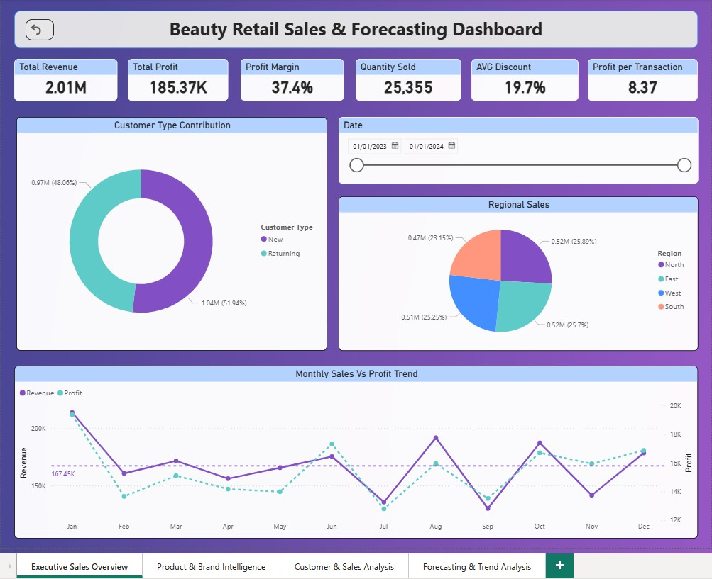
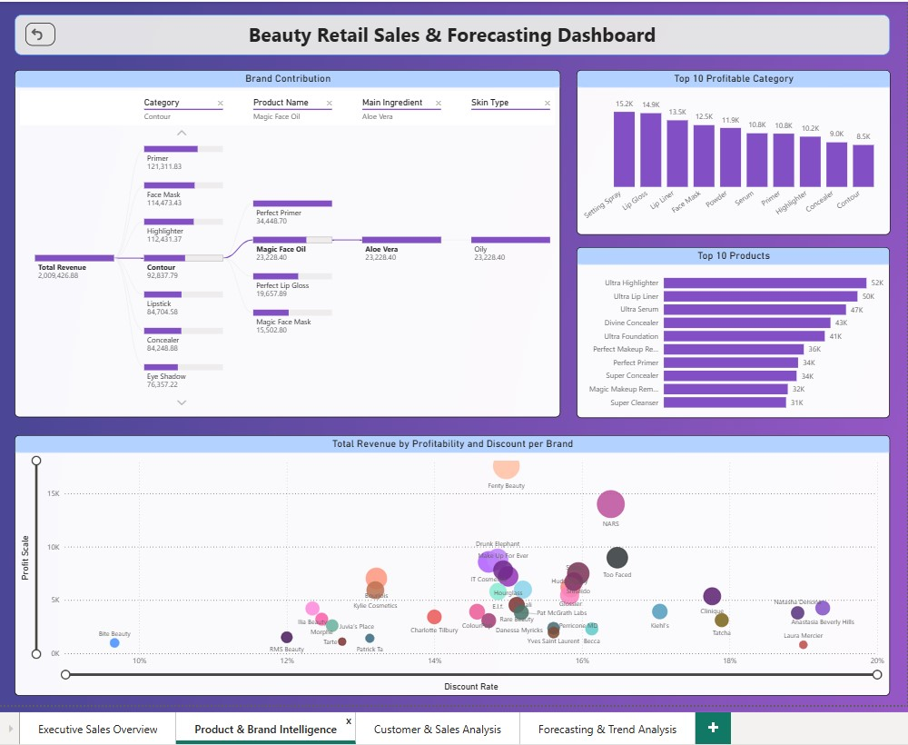
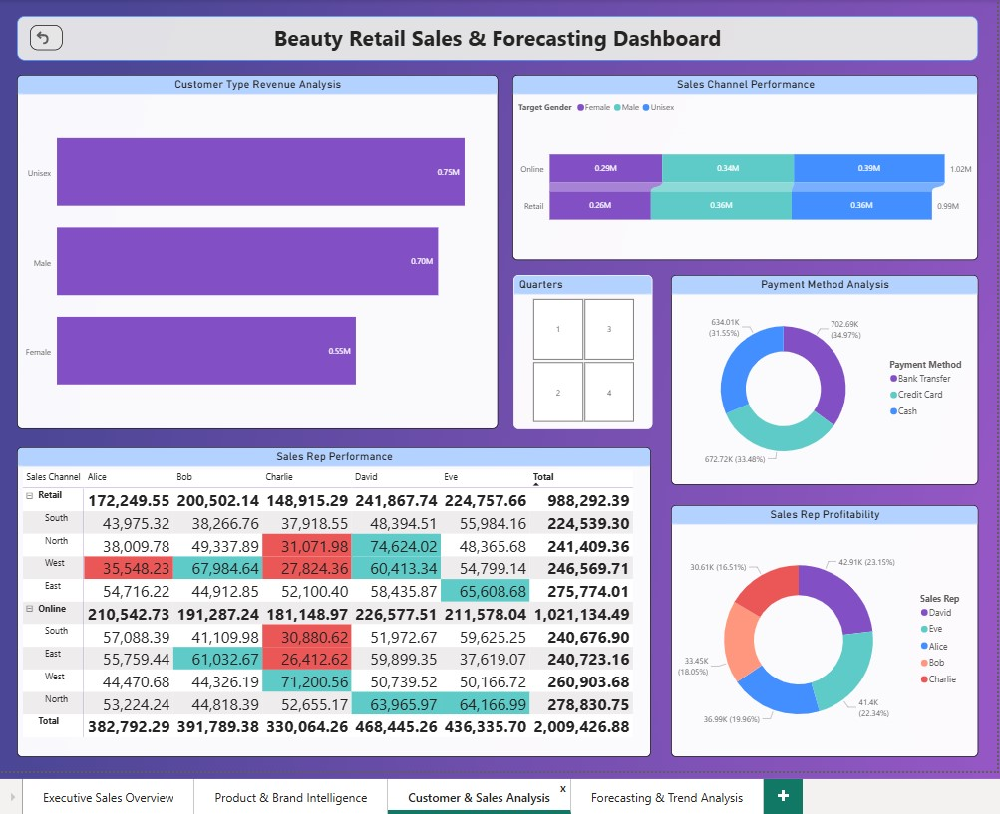
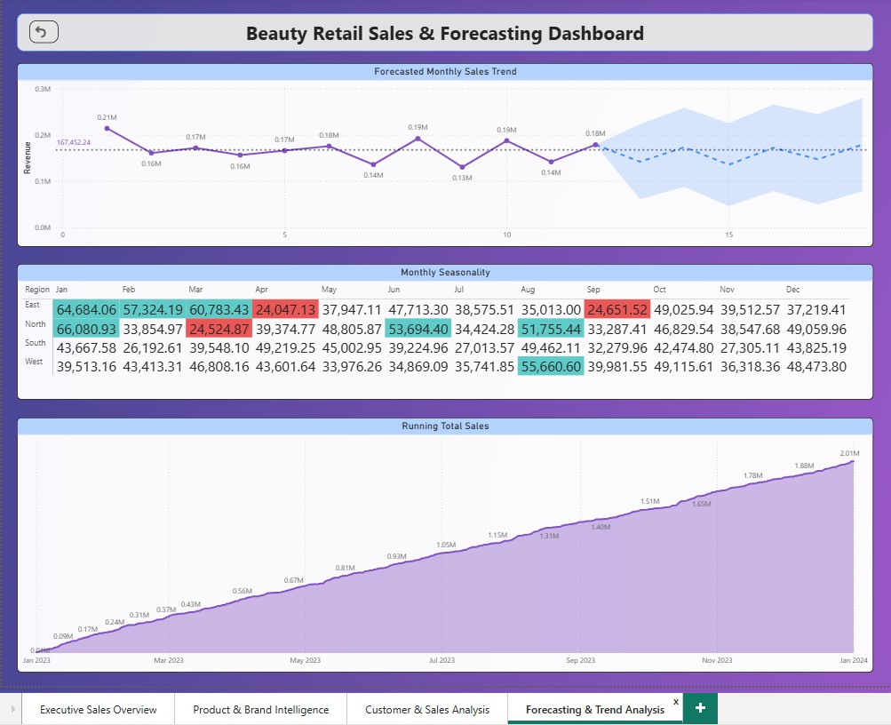

# Beauty Retail Sales & Forecasting Dashboard

Built an interactive Power BI dashboard analyzing retail beauty sales performance, profitability, customer behavior, and forecasting trends using SQL and DAX.

## Tools Used

- SQL
- Power BI
- DAX
- Data Modeling
- Forecasting Analytics

## Key Skills Demonstrated

- SQL Joins
- Window Functions
- KPI Reporting
- DAX Measures
- Forecasting
- Profitability Analysis
- Customer Segmentation

## Key Business Insights

### Include:

- Top-performing brands
- Most profitable categories
- New vs returning customers
- Discount efficiency findings
- Seasonal volatility

1. Total retail revenue exceeded 2 million, with new customers contributing a slightly larger share of overall sales compared to returning customers.
2. Profitability analysis revealed that high sales volume did not always translate into high profit margins, highlighting the importance of margin-focused evaluation.
3. Moderate discount strategies often produced stronger sales outcomes than heavily discounted products, suggesting that product demand and brand positioning influenced performance more than discount depth alone.
4. Monthly sales trends displayed noticeable seasonality, with January recording the highest sales performance and mid-year fluctuations indicating changing consumer purchasing behavior.
5. The dashboard identified a positive relationship between discounting and revenue generation for selected brands, although excessive discounting did not consistently improve profitability.
6. Forecasting and cumulative revenue analysis indicated steady long-term business growth despite periodic monthly volatility.

## Dashboard Preview

### Page 1

### Page 2

### Page 3

### Page 4

